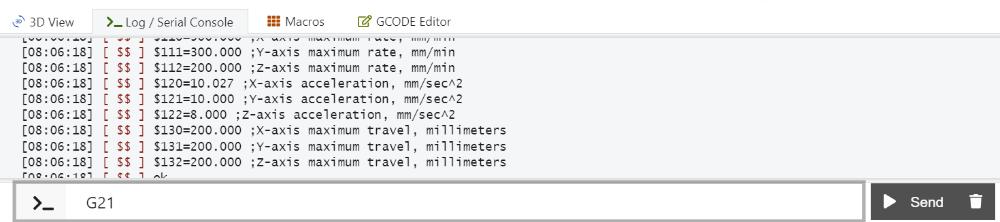

# Calibración de la CNC

En esta sección ajustaremos los parámetros más importantes de **GRBL** para que tu máquina:

- Se mueva la **distancia correcta** (steps/mm).
- Tenga **velocidades y aceleraciones** razonables para tu mecánica.
- Pueda usar **homing** y **límites** para trabajar de forma más segura.

---

## 0. Dónde se guardan los parámetros de GRBL

GRBL guarda su configuración interna en la **EEPROM del Arduino**. Esto significa que:

- Los valores se mantienen aun cuando apagas la máquina o desconectas el USB.
- Solo cambian cuando tú los modificas con los comandos `$`.

Comandos clave:

- `$$` → muestra **toda la configuración actual** de GRBL.
- `$<n>=<valor>` → cambia un parámetro específico. Ejemplo:
  - `$100=80` → pone 80 steps/mm en el eje X.
- `#` → muestra offsets (G54, G92, etc., más avanzado).

> 💡 Es buena práctica:
> - Ejecutar `$$` y **guardar en un archivo de texto** una copia de tus valores actuales.
> - Anotar los cambios importantes que vayas haciendo.

---

## 1. Calibrar pasos de motor a mm: steps/mm

GRBL convierte los movimientos en **pasos de motor**. Cada motor paso a paso tiene:

- Ciertos **pasos completos** por vuelta (típicamente 200 pasos/rev).
- Un **microstepping** configurado en el driver (por ejemplo 1/16).
- Un mecanismo mecánico (husillo, banda, cremallera…) que convierte las vueltas en **mm de avance**.

Fórmula general:

```text
steps/mm = (pasos_motor_por_vuelta × microsteps × relación_extra) / avance_mm_por_vuelta
```

Donde:

- `pasos_motor_por_vuelta` → típicamente 200 para NEMA 17.
- `microsteps` → depende de cómo pusiste los jumpers MS1–MS2–MS3 (por ejemplo, 16 para 1/16 de paso o 1 si no tienes ningun jumper).
- `relación_extra` → se usa si hay alguna relación mecánica adicional (por ejemplo poleas 2:1). Si no hay, vale 1.
- `avance_mm_por_vuelta` → cuántos mm se mueve el eje por **una vuelta completa** del motor o del mecanismo.

Los parámetros en GRBL son:

- `$100` → steps/mm del eje X  
- `$101` → steps/mm del eje Y  
- `$102` → steps/mm del eje Z  

---

## 2. Husillo (tornillo de potencia)

En un husillo, la distancia que avanza la tuerca por vuelta se llama **lead** o **paso efectivo**.

Ejemplos comunes:

- Husillo T8 con lead de 8 mm → avanza 8 mm por vuelta.
- Husillo con lead de 2 mm → avanza 2 mm por vuelta.

Fórmula:

```text
steps/mm = (pasos_motor_por_vuelta × microsteps × relación_extra) / lead_mm
```

Ejemplo:

- Motor: 200 pasos/vuelta
- Microstepping: 1/16 → `microsteps = 16`
- Lead: 8 mm
- Sin relación adicional (relación_extra = 1)

```text
steps/mm = (200 × 16 × 1) / 8 = 400 steps/mm
```

Este valor lo asignarías al eje que use ese husillo, por ejemplo:

```gcode
$100=400   ; X usa husillo
```

o

```gcode
$101=400   ; Y usa husillo
```

dependiendo de tu mecánica.

---

## 3. Banda dentada + polea

En un sistema de **banda dentada**, la distancia por vuelta depende de:

- El **paso de la banda** (por ejemplo GT2 → 2 mm entre dientes).
- El número de **dientes de la polea**.

Avance por vuelta:

```text
avance_mm_por_vuelta = paso_banda_mm × dientes_polea
```

Fórmula de steps/mm:

```text
steps/mm = (pasos_motor_por_vuelta × microsteps × relación_extra) / (paso_banda_mm × dientes_polea)
```

Ejemplo:

- Banda: GT2 → `paso_banda_mm = 2`
- Polea: 20 dientes → `dientes_polea = 20`
- Motor: 200 pasos/vuelta
- Microstepping: 1/16
- Sin relación adicional

```text
avance_mm_por_vuelta = 2 × 20 = 40 mm
steps/mm = (200 × 16) / 40 = 80 steps/mm
```

De nuevo, este valor lo pondrías en `$100`, `$101` o `$102` según qué eje use banda.

---

## 4. Cremallera + piñón

En una cremallera, un **piñón** (engranaje) avanza sobre dientes lineales.

Si conoces el **módulo** del engranaje y el número de dientes, la distancia por vuelta es:

```text
avance_mm_por_vuelta = π × módulo_mm × dientes_piñón
```

Fórmula de steps/mm:

```text
steps/mm = (pasos_motor_por_vuelta × microsteps × relación_extra) / (π × módulo_mm × dientes_piñón)
```

Ejemplo:

- Motor: 200 pasos/vuelta
- Microstepping: 1/16
- Módulo del piñón: 1 mm
- Dientes del piñón: 20

```text
avance_mm_por_vuelta = π × 1 × 20 ≈ 62.83 mm
steps/mm ≈ (200 × 16) / 62.83 ≈ 50.96 steps/mm
```

> 🔎 Si no conoces el módulo o la geometría exacta de tu cremallera, puedes arrancar con un valor aproximado (por ejemplo 40–60 steps/mm) y luego **ajustar por medición**, como se explica en la siguiente sección.

---

## 5. Ajuste fino por medición (método general)

Siempre es recomendable ajustar por medición, aunque hayas calculado steps/mm con fórmulas. El procedimiento es el mismo para cualquier eje (X, Y o Z) y cualquier mecanismo (husillo, banda, cremallera).

### 5.1. Preparación (En la ventana de comando de OpenBuilds CONTROL)

   

1. Asegúrate de estar en **milímetros** y modo **absoluto**:

   ```gcode
   G21     ; trabajar en mm
   G90     ; coordenadas absolutas
   ```

2. Lleva el eje a una posición de referencia (por ejemplo, cerca de un extremo físico) y pon marcas donde puedas medir con una regla o calibrador.

---

### 5.2. Movimiento de prueba y medición

1. Elige una distancia **comandada** razonable (por ejemplo 10 mm o 20 mm).
2. Envía un movimiento con velocidad moderada:

   ```gcode
   G1 X10 F150   ; ejemplo en eje X 10 mm 'X10'
   ```

3. Mide con la regla/calibrador la **distancia real** que se movió el eje (D_medida).

- Distancia comandada = `D_comandada` (ej. 10 mm).
- Distancia medida = `D_medida` (ej. 5.85 mm).

---

### 5.3. Cálculo del nuevo steps/mm

Usa la fórmula de corrección:

```text
steps_nuevo = steps_viejo × (D_comandada / D_medida)
```

Ejemplo real:

- `steps_viejo = 80` steps/mm
- `D_comandada = 10 mm`
- `D_medida = 5.85 mm`

```text
steps_nuevo = 80 × (10 / 5.85) ≈ 136.75 steps/mm
```

Actualizas el parámetro del eje correspondiente (por ejemplo X):

```gcode
$100=136.75
```

Luego repites la prueba:

1. Vuelves a mandar `G1 X10 F150` desde cero.
2. Mides de nuevo.
3. Si, por ejemplo, ahora obtienes 12.3 mm, repites con:
   - `steps_viejo = 136.75`
   - `D_comandada = 10`
   - `D_medida = 12.3`

Repites el ajuste hasta que obtengas algo cercano a 10 mm (por ejemplo 9.8–10.2 mm).

---

### 5.4. Repetir para Y y Z

- Para el **eje Y**, usas el mismo procedimiento con `$101`.
- Para el **eje Z**, usas `$102`, con recorridos más pequeños (por ejemplo 5 mm) para evitar golpes contra topes o la mesa.

> ✅ Consejo: anota en alguna parte tus valores finales de `$100`, `$101`, `$102` como respaldo, por si en algún momento se borra o resetea la configuración de GRBL.

---

## 6. Configurar velocidades y aceleraciones

Una vez que los **steps/mm** están ajustados, podemos decirle a GRBL:

- Qué **velocidad máxima** permitir por eje.
- Qué **aceleración** usar al arrancar y frenar.

Parámetros principales:

- `$110`, `$111`, `$112` → **velocidad máxima** de X, Y, Z (mm/min).
- `$120`, `$121`, `$122` → **aceleración** de X, Y, Z (mm/s²).

> ⚠️ Si pones valores demasiado altos:
> - Los motores pueden perder pasos.
> - La máquina puede vibrar o hacer ruidos fuertes.
> - Puedes tener errores de seguimiento de trayectoria.

### 6.1. Valores de partida sugeridos (máquina pequeña tipo plotter/fresadora ligera)

Como ejemplo **conservador** para arrancar:

```gcode
$110=1500   ; X max rate 1500 mm/min
$111=1500   ; Y max rate 1500 mm/min
$112=500    ; Z max rate  500 mm/min

$120=50     ; X acceleration 50 mm/s^2
$121=50     ; Y acceleration 50 mm/s^2
$122=20     ; Z acceleration 20 mm/s^2
```

- Z suele tener valores menores porque suele levantar peso y tiene menos margen mecánico.
- Si ves que la máquina se mueve muy suave y sin problemas, puedes ir subiendo poco a poco (por ejemplo +250 mm/min y +10 mm/s² por prueba).

### 6.2. Cómo probar

1. Ajusta los valores con los comandos `$` desde el sender.
2. Haz movimientos de prueba con G-code simples, por ejemplo:

   ```gcode
   G21 G90
   G0 X0 Y0
   G0 X50
   G0 Y50
   G0 X0 Y0
   ```

3. Escucha y observa:
   - Si la máquina se ve forzada o suena muy brusca, baja un poco las aceleraciones.
   - Si todo va muy suave y lento, puedes aumentar max rate gradualmente.

---

## 7. (Opcional) Homing y límites 

Si tienes **finales de carrera** instalados, es muy recomendable activar:

- El ciclo de **homing** (referenciado inicial).
- Los **límites** (para que la máquina no se salga del área útil).

Parámetros clave:

- `$22` → habilitar homing (0 = desactivado, 1 = activado).
- `$23` → dirección de homing (máscara de bits).
- `$24` → velocidad de homing lenta (feed rate).
- `$25` → velocidad de homing rápida (seek rate).
- `$26` → debounce de los switches (ms).
- `$27` → pull-off, distancia de separación después de tocar el switch (mm).
- `$20` → soft limits (0 = off, 1 = on).
- `$21` → hard limits (0 = off, 1 = on).

### 7.1. Secuencia recomendada

1. Verifica que los **finales de carrera** estén bien cableados (ver sección de hardware):
   - Normalmente **NC** entre `S` y `GND`.

2. Configura parámetros de homing razonables, por ejemplo:

   ```gcode
   $24=100     ; homing feed rate (lento)
   $25=500     ; homing seek rate (rápido)
   $26=250     ; debounce 250 ms
   $27=2.0     ; pull-off 2 mm
   ```

3. Define hacia dónde quieres que se mueva cada eje en el homing mediante `$23`.
   - Esto depende de dónde estén físicamente tus switches (mínimo o máximo).
   - Ejemplo típico (solo referencia; debes ajustarlo a tu máquina):

     ```gcode
     $23=0   ; homing hacia X-, Y-, Z+ (por defecto GRBL)
     ```

4. **Activa el homing**:

   ```gcode
   $22=1
   ```

5. Reinicia GRBL (o reconecta el sender) y prueba el homing con:

   ```gcode
   $H
   ```

   - La máquina debe moverse hacia los switches, tocarlos, retroceder, y volver a tocarlos más lento.

> ⚠️ Si ves que un eje se va en dirección contraria y choca, **apaga la máquina de inmediato** y ajusta `$23` o la inversión de dirección (`$3`) antes de reintentar.

### 7.2. Límites suaves y duros

Una vez que:

- Tienes **steps/mm** correctos.
- Has medido el **recorrido máximo** de cada eje (`$130`, `$131`, `$132`).
- El homing funciona bien.

Puedes activar límites:

- `$20=1` → **soft limits** (recomendado).
- `$21=1` → **hard limits** (usa la señal de los switches en cualquier momento).

Los soft limits usan la información de:

- Origen de máquina tras homing.
- `X_max`, `Y_max`, `Z_max` (parámetros `$130`, `$131`, `$132`).

Si un G-code intenta salir de ese volumen, GRBL da alarma y no ejecuta el movimiento.

---

## 8. (Opcional) Recorrido máximo y parámetros $130–$132

Para usar bien los límites suaves, necesitas medir el **recorrido útil** de cada eje.

1. Después de hacer homing, mueve manualmente (con jog) cada eje hasta el extremo opuesto seguro.
2. Anota el valor que marca el sender en cada eje (X, Y, Z).
3. Usa esos valores como:

```gcode
$130=X_max   ; recorrido máximo en X (mm)
$131=Y_max   ; recorrido máximo en Y (mm)
$132=Z_max   ; recorrido máximo en Z (mm)
```

Con eso, y con `$20=1`, GRBL ya sabe cuál es el volumen de trabajo permitido.

---

## Siguiente sección

[Crear tu primer archivo G-code (.nc)](primer-gcode.md)
