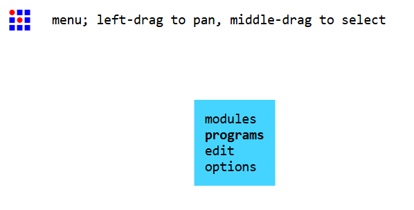
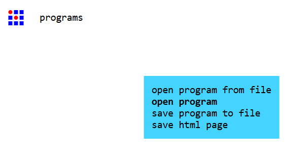
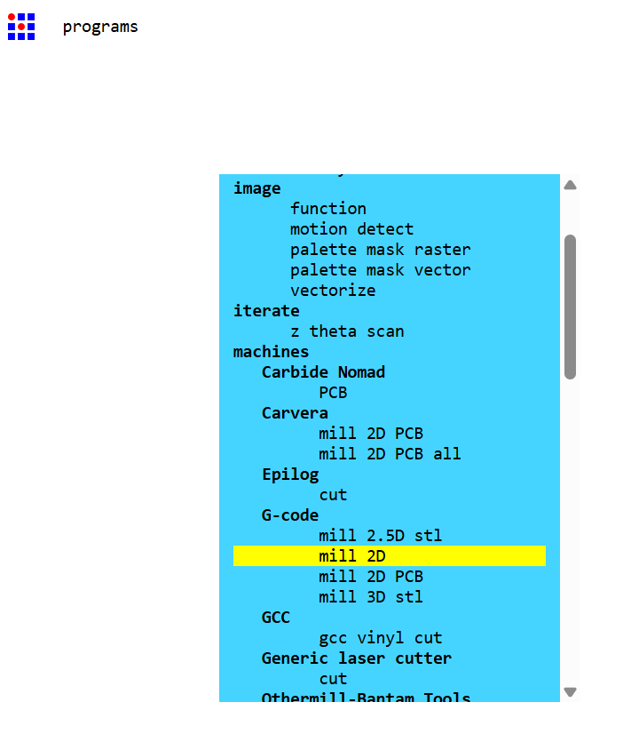
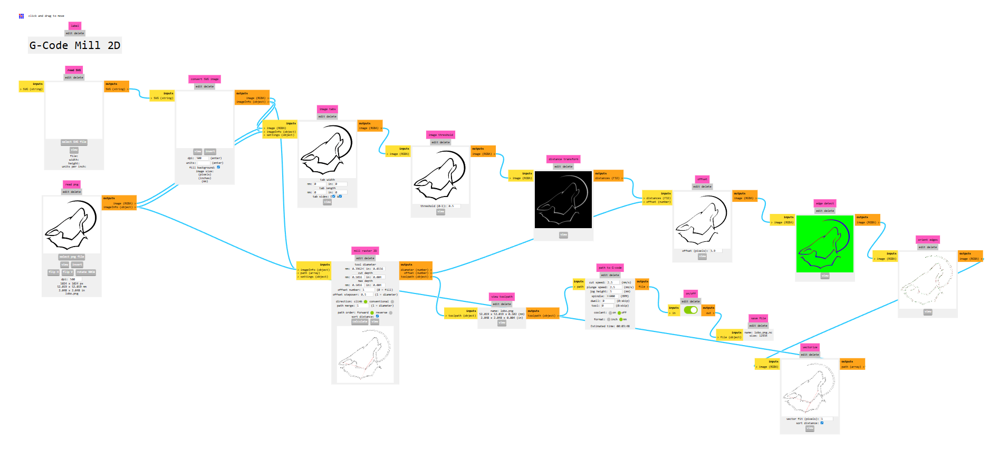
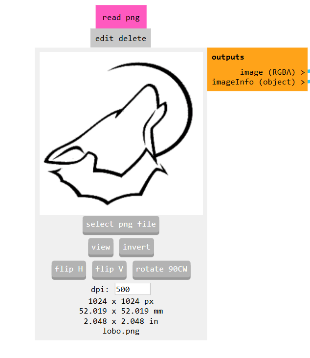
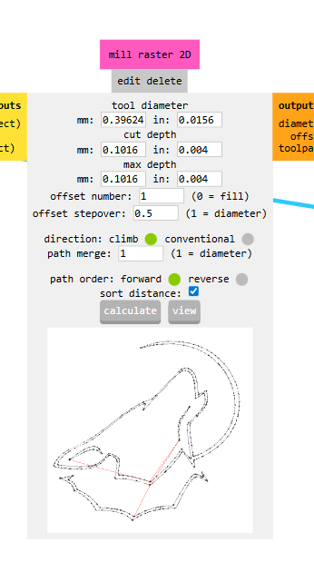
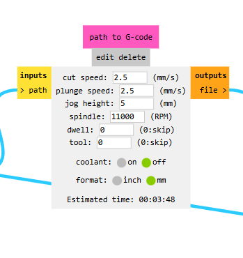
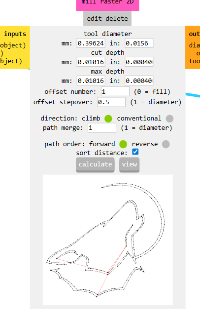
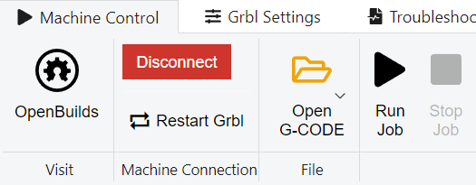
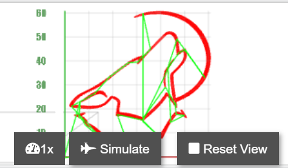

# Flujo de trabajo con FabModules

En esta sección veremos cómo pasar de una **imagen en blanco y negro (PNG)** a un archivo **G-code `.nc`** usando **FabModules**, y luego cómo enviarlo a la CNC con OpenBuilds CONTROL.

Nos centraremos en:

- Logos o dibujos sencillos (por ejemplo, un círculo o las letras **IBERO**).
- Imágenes en **blanco y negro**, sin escala de grises.
- Proceso **G-code → mill 2D** dentro de FabModules.

---

## 1. Preparar la imagen PNG

Puedes crear tu imagen en cualquier editor (Inkscape, GIMP, Krita, etc.) y exportarla como **PNG** en blanco y negro.

Recomendaciones:

- Fondo **blanco** y trazos **negros** (o al revés; luego podemos invertir).
- Sin degradados ni sombras; solo líneas y rellenos sólidos.
- Resolución suficiente (por ejemplo 500 dpi), pero no es crítico mientras se vea nítido.

Guarda el archivo, por ejemplo:

- `circulo.png` Descarga: [imagen](assets/img/G_code/circulo.png) [nc](assets/img/G_code/circulo.nc)
- `ibero.png` Descarga: [imagen](assets/img/G_code/IBERO.png) [nc](assets/img/G_code/IBERO.nc)

---

## 2. Abrir el programa G-code / mill 2D en FabModules

1. Abre **FabModules** del MIT en el navegador: [FabModules](../mods/)
2. Haz clic derecho en el fondo blanco.
3. Selecciona: **programs**.  
   
4. Elige **open program** para cargar el programa `G-code mill 2D`.  
   
5. En la lista, ve a:

   ```text
   machines → G-code → mill 2D
   ```

   

Deberías ver un “grafo” con varios módulos conectados (read png, image ops, mill 2D, path to G-code, save file…).  


---

## 3. Cargar la imagen PNG

En el módulo **read png**:

1. Haz clic en el botón **select png file**.
2. Elige tu archivo, por ejemplo `ibero.png` o `circulo.png`.
3. Verás la vista previa de la imagen, junto con información de tamaño y dpi.



Opciones útiles en este módulo:

- **invert** → invierte blanco/negro (útil si tu dibujo está en negativo).
- **flip H / flip V** → espejar horizontal o verticalmente.
- **rotate 90CW** → rotar si la imagen entra girada.

### 3.1. Ajustar el tamaño en mm

Debajo de la imagen suelen aparecer:

- Resolución (dpi).  
- Tamaño en píxeles.  
- Tamaño en **mm**.

Puedes:

- Cambiar el valor de **dpi** para ajustar el tamaño en mm (más dpi = más pequeño, menos dpi = más grande).
- Usar como referencia tu área útil de trabajo (por ejemplo 100×70 mm, y usar ~80% de ese espacio).

> 💡 Ejemplo: si quieres que el logo **IBERO** tenga ~60 mm de ancho, ajusta el dpi hasta que el ancho en mm se aproxime a 60.

---

## 4. Opcional: operaciones de imagen

Dependiendo del programa `mill 2D` que uses, puede haber módulos intermedios como:

- `image threshold`
- `edge detect`
- etc.

En muchos casos, con una imagen en blanco y negro bien preparada basta con:

- Ajustar **threshold** si lo hay (para reforzar el contraste).
- Ver en la vista previa que las líneas se ven claras y limpias.

Si el flujo que cargas ya está preparado (como en el ejemplo de las capturas), usualmente no necesitas modificar estos módulos.

---

## 5. Configurar el módulo Mill 2D / Mill raster 2D

Localiza el módulo **mill 2D** o **mill raster 2D** (nombre depende de la versión).  
Se ve parecido a esto:



Parámetros importantes:

- **tool diameter (mm)**  
  - Diámetro efectivo de tu herramienta.  
  - Para un plumín o lápiz fino puedes usar valores pequeños (ej. 0.3–0.5 mm).
- **cut depth (mm)**  
  - Profundidad por pasada.  
  - Para **dibujo** suele ser muy pequeña (ej. 0.05–0.10 mm) o igual a la profundidad final.
- **max depth (mm)**  
  - Profundidad final.  
  - Para dibujo: un valor muy pequeño negativo (ej. `-0.1 mm`) si quieres que quede registrado como corte superficial.
- **offset number**  
  - `1` → recorre solo el contorno principal (esto es lo que nos interesa).  
  - `0` → relleno completo (fill), suele generar muchas trayectorias.
- **offset stepover**  
  - Para un solo contorno, 0.5 está bien (no es tan crítico en modo dibujo).
- **direction** (climb / conventional) y **path order** (forward / reverse)  
  - Para un plumín no importa demasiado, pero para fresado sí.

Flujo de uso:

1. Ajusta **tool diameter**, **cut depth**, **max depth** y pon **offset number = 1**.
2. Haz clic en **calculate**.

---

## 6. Configurar Path to G-code

Ahora localiza el módulo **path to G-code**:



Parámetros clave:

- **cut speed (mm/s)**  
  - Velocidad de corte.  
  - Para dibujo/pluma: valores de 1–3 mm/s son suaves (equivalen a 60–180 mm/min).
- **plunge speed (mm/s)**  
  - Velocidad al bajar en Z.  
  - Puedes usar algo similar a cut speed (1–2 mm/s).
- **jog height (mm)**  
  - Altura de seguridad cuando la herramienta se desplaza “en vacío”.  
  - Ejemplo: **5 mm** para evitar golpear el papel o pinzas.
- **spindle (RPM)**  
  - Para dibujo con lápiz puedes dejar el valor por defecto; no se usará si no controlas el spindle.
- **format**  
  - Asegúrate de seleccionar **mm** (no inch).

Cuando estés conforme:

1. Confirma que **format = mm**.
2. Ajusta **jog height** (por ejemplo 5 mm).
3. Haz clic en **calculate** para que genere el archivo G-code interno.

---

## 7. Exportar el archivo `.nc`

Al fterminar de configurar el flujo dale al boton de calcular en mill raster 2D y el archivo **.nc** se descargara automaticamen. :



Ya tienes un archivo G-code listo para enviar a la CNC.

---

## 8. Cargar el `.nc` en OpenBuilds CONTROL y probar

Ahora seguimos un flujo muy parecido al del cuadrado simple.

### 8.1. Preparar la máquina

1. Abre **OpenBuilds CONTROL** y conéctate a tu placa GRBL.
2. Coloca el **papel o material** donde se dibujará el logo.
3. Mueve la máquina con los controles de **jog** hasta el punto donde quieres el **origen (X0, Y0)** del dibujo, este coincidira con la esquina inferior izquierda de la imagen que se le dio, incluyendo los espacios en blanco de la imagen.
4. Ajusta **Z** para que el plumín o lápiz:
   - Toque suavemente el papel (para prueba real), o
   - Quede 2–3 mm por encima (para una “prueba en el aire”).

5. Haz **Zero** en X, Y y Z desde OpenBuilds CONTROL.


### 8.2. Cargar y revisar el archivo

1. Haz clic en **Open File / Cargar archivo**.
2. Selecciona tu archivo `ibero.nc` o `circulo.nc`.
3. Revisa el **Gcode Editor** para ver el codigo G generado por FabModules.


4. Revisa la **vista previa** o **3D View**:

   - El tamaño debe coincidir aproximadamente con lo esperado (por ejemplo, 60 mm de ancho para IBERO).
   - El origen del dibujo debe estar donde esperabas (esquina u origen del diseño).



### 8.3. Ejecutar el programa

1. Para la **primera prueba**, es recomendable:

   - Dejar Z un poco más alta (por ejemplo +2 mm) para que la pluma no toque el papel, o
   - Editar en FabModules la profundidad (max depth) a 0 y solo observar el movimiento.

2. Cuando estés listo, presiona **Start / Run** en OpenBuilds.


3. Observa:

   - El eje Z sube a la **jog height** definida en FabModules.
   - Baja a la profundidad de dibujo y sigue el contorno de la imagen.
   - Una vez terminado, vuelve a la altura de seguridad.

Si todo se ve bien, ajusta Z para que el lápiz toque el papel y repite la ejecución para obtener el trazo real.

<video controls width="640">
  <source src="{{ '/assets/img/lobo.mp4' | relative_url }}" type="video/mp4">
  Tu navegador no soporta video HTML5.
</video>

---

## 9. Notas y ajustes frecuentes

- **Escala incorrecta**  
  - Revisa el dpi y tamaño en mm en el módulo **read png**.
  - Confirma que `format = mm` en **path to G-code**.
- **El dibujo sale invertido (blanco/negro al revés)**  
  - Usa el botón **invert** en el módulo **read png**.
- **El origen no coincide**  
  - Cambia dónde haces **Zero** en la máquina.
  - O re-centra la imagen en el lienzo antes de generar el G-code.
- **Demasiadas pasadas o rellenos**  
  - Asegúrate de que **offset number = 1** en el módulo **mill 2D / mill raster 2D**.

Con este flujo puedes convertir fácilmente logos simples (como un círculo o las letras IBERO) en G-code y dibujarlos en tu CNC.

---

## Siguiente paso

Una vez que domines este procedimiento, puedes:

- Probar diferentes imágenes en blanco y negro.
- Ajustar diámetros de herramienta y profundidades para pasar de “dibujo” a “grabado ligero”.
- Integrar este flujo en el diseño de tus propios logos, patrones o procesos.
