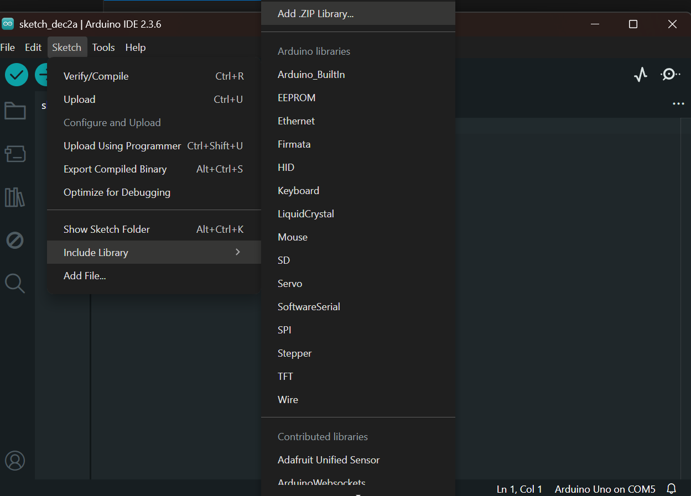
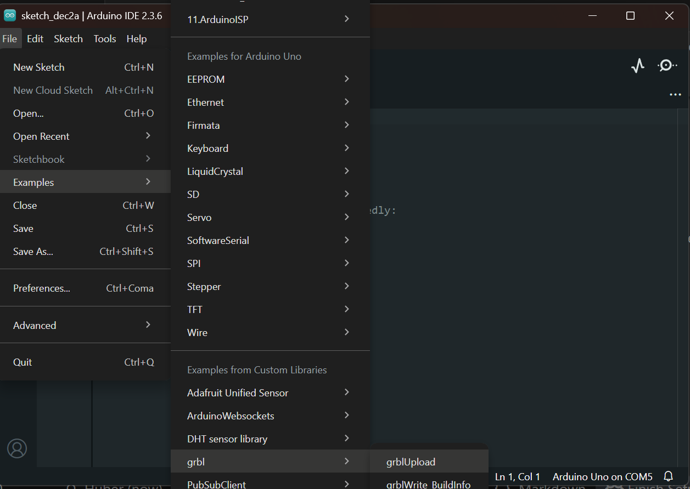
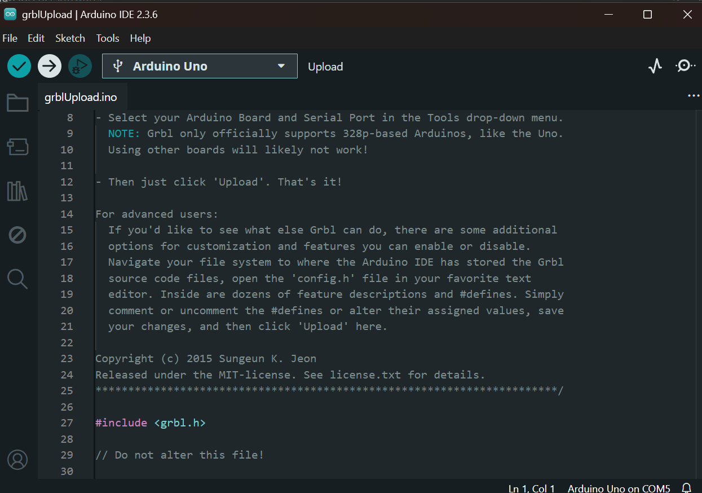
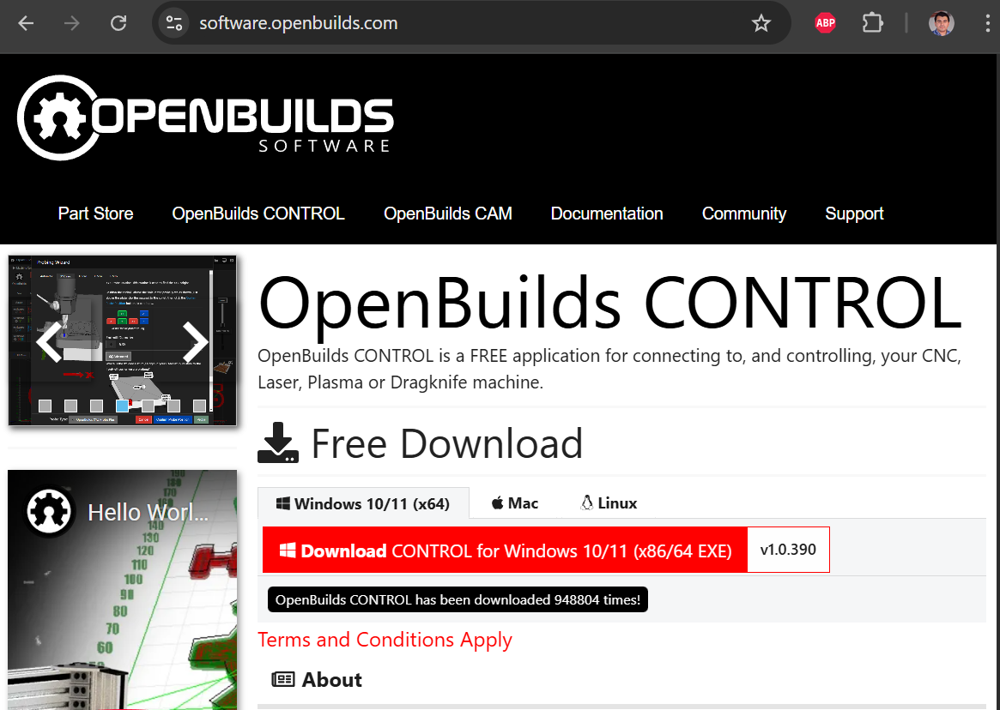
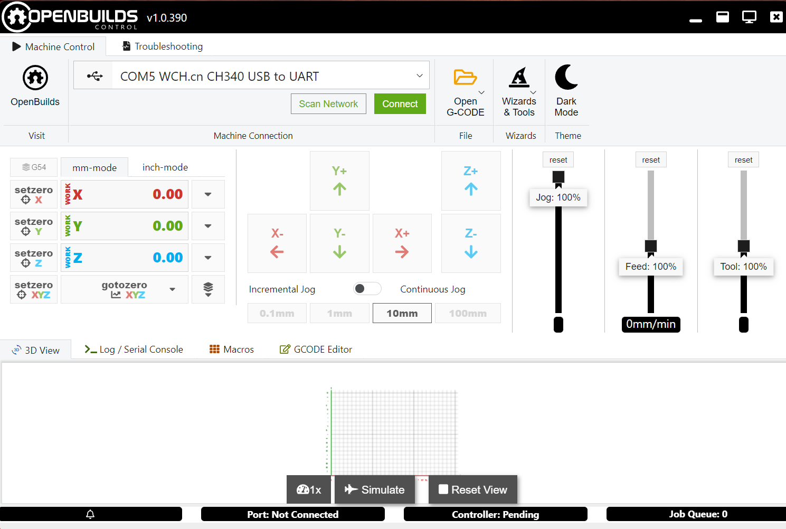
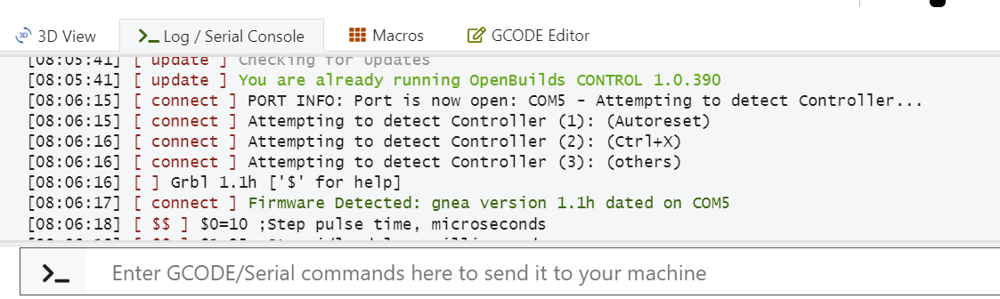
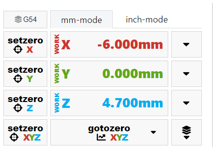
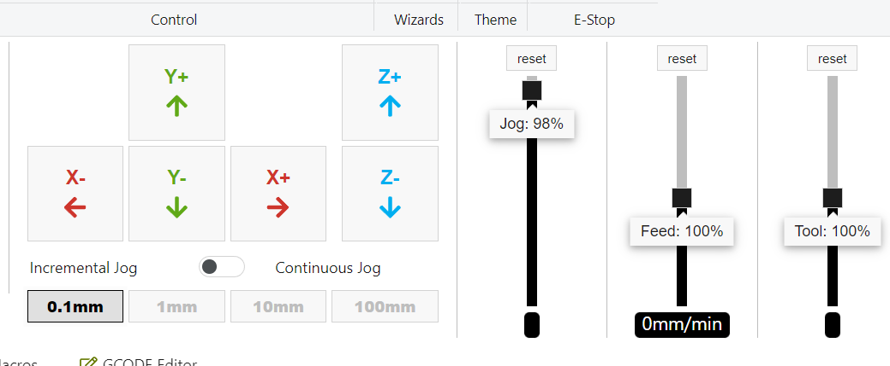

# Software: GRBL y OpenBuilds CONTROL

En esta sección se explica cómo:
- Instalar el firmware **GRBL 1.1h** en el Arduino.
- Instalar y configurar **OpenBuilds CONTROL** como sender.
- Hacer los **primeros movimientos de prueba** (jog) para verificar que todo se mueve y gira en la dirección correcta.

> ⚠️ **Importante:** En este punto la máquina **todavía no está calibrada**. Solo haremos movimientos pequeños para verificar conexiones y sentido de giro.

---

## 1. Arduino IDE

1. Descarga e instala **Arduino IDE** desde la página oficial de Arduino.
2. Conecta el Arduino UNO por USB a tu computadora.
3. En el menú `Herramientas` de Arduino IDE selecciona:
   - `Placa` → **Arduino Uno**
   - `Puerto` → COM correspondiente al Arduino (en Windows) o el puerto equivalente en macOS / Linux.

   

---

## 2. Instalar GRBL 1.1h en el Arduino

1. Descarga el ZIP de **GRBL 1.1** desde [aqui](assets/files/grbl.zip).
   - Guarda el archivo ZIP en una carpeta fácil de localizar.

2. En Arduino IDE, agrega GRBL como librería:
   - Menú `Programa → Incluir librería → Añadir biblioteca .ZIP…`
   - Selecciona el ZIP de GRBL que acabas de descargar.

   

3. Abre el ejemplo de carga de GRBL:
   - Menú `Archivo → Ejemplos → grbl → GrblUpload`.

   

4. Verifica que sigues teniendo seleccionados:
   - Placa: **Arduino Uno**
   - Puerto: el del Arduino

5. Haz clic en **Subir** (ícono de flecha a la derecha).
   - Espera a que termine la compilación y carga.
   - En la parte inferior debe aparecer `Subido` sin errores.

   


6. Opcional: comprobar que GRBL está corriendo
   - Abre el **Monitor serie** de Arduino IDE.
   - Configura la velocidad en **115200 baudios**.
   - Presiona el botón de reset del Arduino (o desconecta y conecta el USB).
   - Deberías ver un mensaje similar a:
   
     ```text
     Grbl 1.1h ['$' for help]
     ```

   Si ves otra versión (por ejemplo 0.9), revisa que hayas cargado el ejemplo correcto.

---

## 3. OpenBuilds CONTROL (sender)

OpenBuilds CONTROL es el programa que usaremos para enviar comandos y archivos G-code a GRBL.

### 3.1. Descarga e instalación

1. Descarga el instalador de **OpenBuilds CONTROL** desde la página oficial:

   [Descargar OpenBuilds CONTROL](https://software.openbuilds.com/)

2. Instálalo siguiendo el asistente de tu sistema operativo (Windows, macOS o Linux).

   

---

### 3.2. Primera conexión con GRBL

1. Conecta el Arduino UNO (con GRBL ya instalado) a la computadora por USB.
2. Abre **OpenBuilds CONTROL**.
3. En la parte superior o lateral verás la lista de puertos disponibles.
   - Selecciona el **puerto COM** correspondiente al Arduino.
   - Haz clic en **CONNECT**.

   

4. En la consola (panel de mensajes) debe aparecer un mensaje similar a:

   ```text
   [MSG:'$H'|'$X' to unlock]
   Grbl 1.1h ['$' for help]
   ```

   

   - Si aparece una advertencia de **ALARM**, por ahora solo indica que GRBL está bloqueado por seguridad (por ejemplo, falta homing). Más adelante lo configuraremos; por ahora solo queremos verificar movimiento.

---

### 3.3. Cambiar a milímetros en OpenBuilds

Antes de mover la máquina, es importante asegurarnos de trabajar en **milímetros**.

1. En la interfaz principal de OpenBuilds CONTROL busca el selector de unidades (`Units`).
2. Cambia a **mm** (en lugar de pulgadas / inches).
3. Verás que los valores de distancia y los controles de jog se muestran ya en milímetros.

   

Además, puedes enviar desde la consola el comando:

```gcode
G21
```

para indicar a GRBL que trabaje en milímetros (esto se puede automatizar después en la configuración).

---

## 4. Primeros movimientos de prueba (jog)

En esta etapa **solo queremos comprobar**:

- Que cada eje se mueve.
- Que el sentido de giro es correcto.
- Que ningún motor está atorado o vibrando raro.
- Que drivers y motores tienen corriente suficiente (sin pasarse).

> ⚠️ **Seguridad:** asegúrate de que no haya nada que pueda interferir con el movimiento (topes, cables tensos, herramientas cerca). Ten la mano cerca de la fuente o el botón de apagado.

### 4.1. Configurar pasos de jog pequeños

En el panel de movimiento (jog) de OpenBuilds CONTROL:

1. Ajusta el **incremento de movimiento** (step) al **mínimo disponible** (por ejemplo 0.1 mm o 1 mm, según la configuración de tu versión).
2. Ajusta la **velocidad de jog** (feedrate) a un valor bajo, por ejemplo:
   - 100–300 mm/min para las primeras pruebas.

   

> Como la máquina todavía **no está calibrada**, pedirle que se mueva “1 mm” puede traducirse en un movimiento mucho mayor (10, 20, 100 mm, etc.). Por eso es importante:
> - Usar siempre el **paso más pequeño**.
> - Tener espacio suficiente en el área de trabajo.

---

### 4.2. Probar el eje X

1. Asegúrate de que el carro del eje X tenga recorrido libre hacia ambos lados.
2. En OpenBuilds, haz clic en el botón de **X+** (mover en sentido positivo) una vez.
3. Observa:
   - ¿Se mueve el eje X?  
   - ¿Se mueve en la dirección esperada (por ejemplo, hacia la derecha)?  
   - ¿El movimiento es suave o el motor vibra/traquetea?

4. Si el motor **tiembla pero no avanza**:
   - Revisa la conexión de las bobinas en el driver (ver sección de hardware).
5. Si se mueve pero en **dirección invertida**:
   - se corrige invirtiendo el conector completo de cables del motor a pasos o desde los parámetros de GRBL.


---

### 4.3. Probar el eje Y

1. Repite el proceso con el eje Y usando los botones **Y+** y **Y−**.
2. Verifica:
   - Que el eje se mueve sin atorarse.
   - Que la dirección tiene sentido con tu sistema de coordenadas (por ejemplo, Y+ hacia el fondo de la máquina).


Si el eje Y se comporta diferente (más lento, más ruidoso) puede ser por:
- Diferencia mecánica (husillo vs banda).
- Parámetros futuros de velocidad/aceleración (que ajustaremos en la etapa de calibración).

---

### 4.4. Probar el eje Z

1. Haz pruebas cortas con los botones **Z+** y **Z−**.
2. Observa:
   - **Z+** debería alejar la herramienta de la pieza (subir).
   - **Z−** debería acercarla a la pieza (bajar).

> ⚠️ En el caso del eje Z, ten especial cuidado para evitar golpes contra los topes mecánicos. Usa el paso mínimo y vigila visualmente el recorrido.

---

### 4.5. Opcional: Probar un cuarto eje (A) si está presente

Si estás utilizando el cuarto driver (A) del CNC Shield:

- Verifica cómo está configurado (clonado de X, eje independiente, etc.).
- Si OpenBuilds permite controlar el eje adicional desde la interfaz, haz también pequeñas pruebas de jog.

Esto es opcional y depende de la configuración específica de tu máquina.

---

## 5. Qué revisar si algo no se mueve bien

Durante estas pruebas de jog, aprovecha para verificar:

- **Motores que no se mueven**:
  - ¿La fuente está encendida y conectada a la shield?
  - ¿$1=255 en GRBL? (mantener habilitados los drivers, esto se configurará más adelante).
- **Motores que vibran pero no giran**:
  - Revisa el orden de los cables de las bobinas en el conector.
- **Motores muy ruidosos o que se traban al primer movimiento**:
  - Baja la velocidad de jog.
  - Revisa que el eje mecánico no esté forzado o desalineado.
  - Más adelante ajustarás la corriente (Vref) del driver.
- **Direcciones invertidas (X, Y o Z al revés)**:
  - No es un error grave en esta etapa; se corrige invirtiendo el conector completo de cables del motor a pasos o desde los parámetros de GRBL.

En la siguiente sección se explicará cómo:

- Ajustar pasos por milímetro.
- Configurar velocidades y aceleraciones.
- Activar homing y límites.
- Verificar que los movimientos sean precisos y repetibles.

---

## Siguiente sección

[Calibración](calibracion.md)
